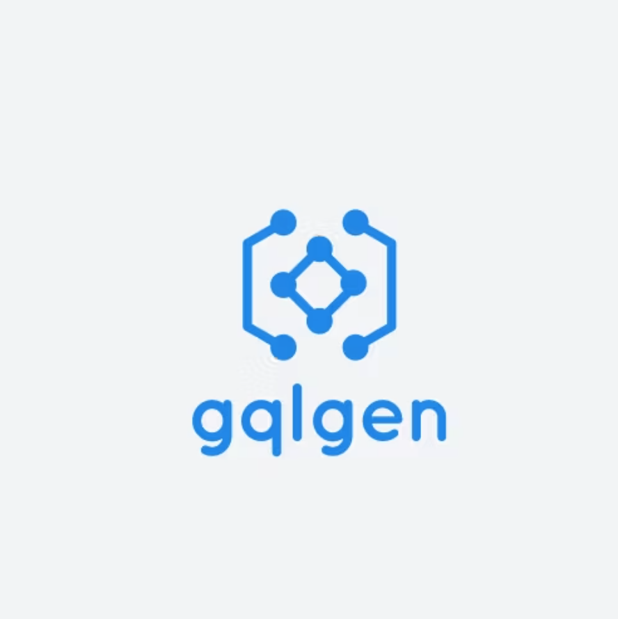
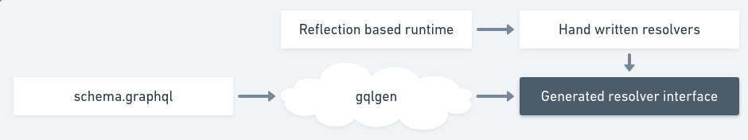
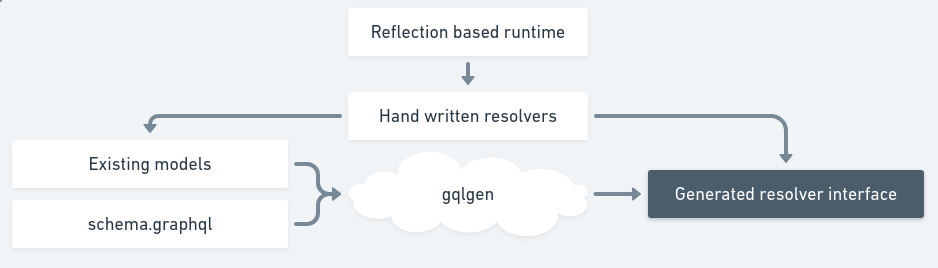
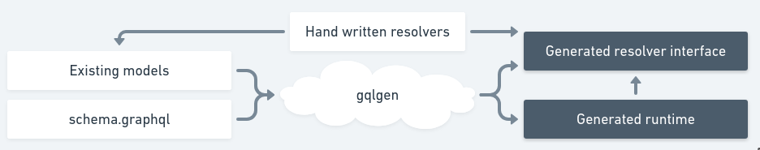
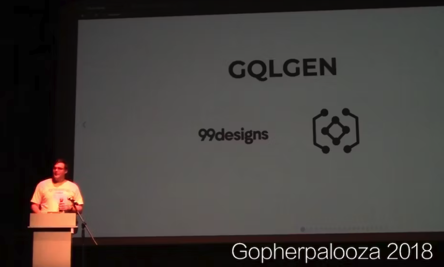

# Представляем gqlgen: генератор серверов GraphQL для Go

В 99designs мы находимся на пути деконструкции нашего PHP-монолита в микросервисную архитектуру, при этом большинство новых сервисов пишется на Go. В этот период наша фронтенд-команда также применила безопасность типов, перейдя с Javascript на TypeScript и React.



После того как мы внедрили безопасность типов в бэкенд и фронтенд, стало очевидно, что наши конечные точки REST, созданные на заказ, не могут преодолеть разрыв между типами. Нам нужен был способ объединить эти системы типов и распутать наши конечные точки API.

Нам нужна была система безопасности типов для API. GraphQL выглядел многообещающе. Однако, изучив его, мы поняли, что не существует серверного подхода, который бы отвечал всем нашим требованиям. Поэтому мы разработали свой собственный, который мы назвали gqlgen.

## Что такое GraphQL?

GraphQL - это язык запросов для API, который дает полное и понятное описание данных и позволяет клиентам запрашивать именно то, что им нужно (и не получать ничего лишнего).

Например, мы можем определять типы: скажем, у пользователя (**user**) есть несколько полей, в основном скалярных, таких как имя и рост (**name** & **height**), но также и других сложных типов, например местоположение (**location**).

В отличие от REST, мы запрашиваем конечную точку GraphQL, **описывая форму результата**:

```graphql
{
  user(id: 10) {
    name
    location {
      lat
      long
    }
  }
}
```

Поля могут принимать аргументы, которые действуют аналогично параметрам запроса, и они могут находиться на любом уровне графа.

Из приведенного выше запроса сервер возвращает:

```json
{
  "user": {
    "name": "Bob",
    "location": {
      "lat": 123.456789,
      "lon": 123.456789
    }
  }
}
```

Это очень важно, потому что дает нам общую систему типов, понятную и клиенту, и серверу, а также обеспечивает потрясающую возможность повторного использования. Что, если мы захотим отобразить местоположение трех наших лучших друзей на другом экране?

```graphql
{
  user(id: 10) {
    friends(limit: 3) {
      name
      location {
        lat
        long
      }
    }
  }
}
```

и мы получим:

```json
{
  "user": {
    "friends": [
      {
        "name": "Carol",
        "location": { "lat": 1, "lon": 1 }
      },
      {
        "name": "Carlos",
        "location": { "lat": 2, "lon": 2 }
      },
      {
        "name": "Charlie",
        "location": { "lat": 3, "lon": 3 }
      }
    ]
  }
}
```

Прощайте конечные точки, созданные на заказ, здравствуйте безопасные, открываемые, согласованные API!

## Чем gqlgen отличается от других подходов к созданию серверов GraphQL?

Первое, что вам нужно сделать, когда вы решили использовать GraphQL, - это решить, какую серверную библиотеку использовать. Оказывается, существует несколько различных подходов к **определению типов** и **выполнению запросов** - основным функциям нашего GraphQL-сервера.

### Определение типов

Первое, что нам нужно сделать для любого сервера GraphQL, - это определить типы. Это позволит серверу проверять входящие запросы и предоставлять API для интроспекции, которые могут обеспечить работу автозаполнения и других полезных функций. Существует три основных подхода к определению типов:

**1. Пользовательский язык, специфичный для домена - Domain Specific Language**

Вы можете построить дерево типов непосредственно в выбранном вами языке программирования. Это проще всего реализовать для серверной библиотеки, но часто приводит к тому, что пользователю приходится писать много кода. DSL отлично работают в некоторых языках, но в Go они очень многословны:

```go
var queryType = graphql.NewObject(graphql.ObjectConfig{
  Name: "Query",
  Fields: graphql.Fields{
    "brief": &graphql.Field{
      Type: briefType,
      Args: graphql.FieldConfigArgument{
        "id": &graphql.ArgumentConfig{
          Type: graphql.NewNonNull(graphql.String),
        },
      },
    },
  },
})
```

Эталонная реализация [graphql-js](https://github.com/graphql/graphql-js) использует этот подход, и многие серверные реализации последовали его примеру, что делает этот подход наиболее распространенным. Полностью динамический подход означает, что вы можете определять схему на лету, основываясь на динамических данных. Это не самое распространенное требование, но если оно вам необходимо, то это единственный способ.

**Недостатки**

- Потеря (во время компиляции) безопасности типов: активное использование открытых `interface{}` и рефлексии.
- Смешивание декларативного кода определения схемы с императивным кодом резолвера, что затрудняет инъекцию зависимостей.
- Код определения схемы невероятно многословен по сравнению со специально разработанным языком определения схемы.

Такой подход обычно очень утомителен и чреват ошибками, и в результате вы получаете нечто не слишком читабельное. Все становится еще хуже, когда в графах есть циклы.

Используется в [graphql-go/graphql](https://github.com/graphql-go/graphql)

**2. Сначала схема - Schema first**

Сравните приведенный выше DSL с эквивалентным языком определения схемы - Schema Definition Language (SDL):

```graphql
type Query {
  brief(id: String!): Brief
}
```

Коротко, лаконично и легко читается. Он также не зависит от языка, поэтому ваша команда фронтенда может использовать [имитации](https://the-guild.dev/graphql/tools/docs/mocking), созданные на основе SDL, чтобы быстро запускать сервер, отвечающий на запросы, и начинать создавать клиентский код параллельно с сервером.

Используется в [99designs/gqlgen](https://github.com/99designs/gqlgen), [prisma/graphqlgen](https://github.com/prisma/graphqlgen) и [graph-gophers/graphql](https://github.com/graph-gophers/graphql-go).

**3. Отражение - Reflection**

Этот подход требует наименьших усилий, поскольку нам не нужно объявлять типы GraphQL в явном виде. Вместо этого мы можем отразить типы из нашего языка и построить на их основе GraphQL-сервер.

На бумаге отражение звучит неплохо, но если вы хотите использовать всю гамму возможностей GraphQL, вам нужно использовать язык, который очень близко сопоставляется с GraphQL. Автоматически создавать интерфейсы и союзы (union) поверх языка с утиной типизацией очень сложно.

Тем не менее, в библиотеке [graphql-ruby](https://github.com/rmosolgo/graphql-ruby) отражение используется с большим эффектом:

```ruby
class Types::ProfileType > Types::BaseObject
  field :id, ID, null: false
  field :name, String, null: false
  field :avatar, Types::PhotoType, null: true
end
```

Хотя это может хорошо работать для таких языков, как Ruby (где DSL - обычное дело), ограничительная система типов Go лимитирует возможности такого подхода.

Используется в [samsarahq/thunder](https://github.com/samsarahq/thunder)

### Выполнение запросов

Теперь, когда мы знаем, что мы раскрываем, нам нужно написать код для ответа на эти GraphQL-запросы. Каждый шаг на этапе выполнения GraphQL должен вызывать функцию, которая выглядит примерно так:

```go
Execute('Query.brief', brief, {id: "123"}) -> Brief
```

Опять же, есть несколько подходов к выполнению этих запросов:

**1. Выставить общую сигнатуру функции**

Наиболее прямой подход заключается в том, чтобы предоставить общую сигнатуру функции непосредственно пользователю, и пусть он сам решает все вопросы.

```go
var queryType = graphql.NewObject(graphql.ObjectConfig{
  Name: "Query",
  Fields: graphql.Fields{
    "brief": &graphql.Field{
      // other props are here but not important right now

      Resolve: func(p graphql.ResolveParams) (interface{}, error) {
        return mydb.FindBriefById(p.Args["id"].(string))
      },
    },
  },
})
```

Здесь есть несколько проблем:

- Нам нужно разобраться с распаковкой `args` из `map[string]interface{}`
- `id` может быть не строкой.
- Правильный ли это тип возврата?
- Даже если это правильный тип, есть ли у него правильные поля?
- Как внедрить зависимости, например подключение к базе данных?

Библиотека может проверять результат во время выполнения, а обширное модульное тестирование выявит эти проблемы.

Опять же, мы можем объявлять новые резолверы и типы во время выполнения без перекомпиляции. Если вам нужна такая возможность, то, скорее всего, вам нужен именно такой подход.

Используется в [graphql-go/graphql](https://github.com/graphql-go/graphql) и [graphql-js](https://github.com/graphql/graphql-js).

**2. Отражение во время выполнения для типов**

Мы можем позволить пользователю самому определять функции с ожидаемыми типами и использовать отражение для проверки того, что все правильно.

```go
type query struct{
    db *myDb
}

func (q *query) Brief(id string) BriefResolver {
    return briefResolver{db, q.db.FindBriefById(id)}
}

type briefResolver struct {
    db *myDb
    *db.Brief
}

func (b *briefResolver) ID() string { return b.ID }
func (b *briefResolver) State() string { return b.State }
func (b *briefResolver) UserID() string { return b.UserID }
```

Это читается немного лучше, библиотека сделала всю логику распаковки за нас, и мы можем инжектировать зависимости. Но дочерние резолверы должны инжектировать свои зависимости вручную. Также отсутствует безопасность во время компиляции, поэтому эта работа возлагается на проверки во время выполнения. По крайней мере, на этот раз мы можем статически проверить весь граф при загрузке, а не требовать 100-процентного покрытия кода, чтобы отловить проблемы.

Используется в [graph-gophers/graphql-go](https://github.com/graph-gophers/graphql-go) и [samsarahq/thunder](https://github.com/samsarahq/thunder)

## Сборка gqlgen

Изучая GraphQL, мы пробовали и `graphql-go/graphql`, и `graph-gophers/graphql-go` в различных проектах. Мы обнаружили, что `graph-gophers/graphql-go` имеет лучшую систему типов, но она не полностью удовлетворяла нашим потребностям. Мы решили попробовать постепенно сделать ее более удобной.

### Генерация интерфейсов резолверов

Начиная с Go 1.4 появилась первоклассная поддержка генерации кода с помощью `go generate`, но ни один из существующих серверов GraphQL не использовал это преимущество. Мы поняли, что вместо проверок во время выполнения можно генерировать интерфейсы для резолверов, а компилятор будет проверять, правильно ли все реализовано.



```go
// in generated code
type QueryResolver interface {
  Brief(ctx context.Context, id string) (*Brief, error)
}

type Brief struct {
  ID string
  State string
  UserID int
}
```

```go
// in our code
type queryResolver struct{
    db *myDb
}

func (r *queryResolver) Brief(ctx context.Context, id string) (*Brief, error) {
  b, err :=  q.db.FindBriefById(id)
  if err != nil {
    return nil, err
  }
  return Brief {
    ID: b.ID,
    State: b.State,
    UserID: b.UserID,
  }, nil
}
```

Отлично! Теперь наш компилятор мог сказать нам, когда сигнатуры резолвера не соответствуют нашей схеме GraphQL. Мы также перешли к более MVC-подобному подходу, где граф резолвера статичен, а зависимости могут быть введены один раз при загрузке, а не должны быть введены в каждый узел.

### Привязка к моделям

Даже сгенерировав безопасные для типов интерфейсы резолвера, мы все еще писали немного ручного кода маппера. Что, если позволить генератору кода проверить существующую модель базы данных на соответствие схеме GraphQL? Если да, то мы могли бы использовать этот тип непосредственно в сигнатурах резолвера.



```go
// in generated code
type QueryResolver interface {
  Brief(ctx context.Context, id string) (*db.Brief, error)
}
```

```go
// in our code
type queryResolver struct{
  db *myDb
}

func (r *queryResolver) Brief(ctx context.Context, id string) (*db.Brief, error) {
  return q.db.FindBriefById(id)
}
```

Отлично. Теперь наш код резолвера был просто безопасным для типов клеем! Это отлично подходит для раскрытия моделей баз данных или даже хорошо типизированных API-клиентов (protobuf, Thrift) через GraphQL.

Но что должно происходить с полями, которые не существуют в модели базы данных? Давайте сгенерируем еще один резолвер.

```go
// in generated code
type BriefResolver interface {
  Owner(ctx context.Context, *db.Brief) (*db.User, error)
}
```

```go
// in our code
type briefResolver struct{
  db *myDb
}

func (r *briefResolver) Owner(ctx context.Context, brief *db.Brief) (*db.User, error) {
  return q.db.FindUserById(brief.OwnerID)
}
```

### Генерируйте код маршалинга и выполнения

Мы не написали почти ни одного шаблона и имеем полную безопасность типов в наших резолверах! Но большая часть фазы выполнения все еще использует оригинальную систему отражения из `graph-gophers`, а [отражение никогда не бывает ясным](https://go-proverbs.github.io/). Давайте заменим основанную на отражении распаковку аргументов и логику вызова резолвера сгенерированным кодом:



```go
func (ec *executionContext) _Brief(ctx context.Context, sel ast.SelectionSet, obj *model.Brief) graphql.Marshaler {
	fields := graphql.CollectFields(ctx, sel, briefImplementors)

	out := graphql.NewOrderedMap(len(fields))
	for i, field := range fields {
		out.Keys[i] = field.Alias

		switch field.Name {
		case "__typename":
			out.Values[i] = graphql.MarshalString("Brief")
		case "id":
			out.Values[i] = graphql.MarshalString(obj.ID)
		case "state":
			out.Values[i] = graphql.MarshalString(obj.State)
		case "user":
			out.Values[i] = _MarshalUser(ec.resolvers.User.Owner(ctx, obj))
		}
	}
	return out
}
```

> Примечание: Это упрощенный пример сгенерированного кода из gqlgen 0.5.1. В реальном коде реализовано параллельное выполнение и расшаривание ошибок.

Мы можем статически генерировать весь выбор полей, привязку и маршаллинг json. Для выполнения GraphQL-запроса нам не нужно ни одной строки рефлексии! Теперь компилятор может отлавливать ошибки на протяжении всего пути. Он может видеть каждый путь кода во время выполнения и отлавливать большинство ошибок. Мы получаем отличные трассировки стека, когда что-то ломается, и это позволяет нам быстро итерироваться над функциями внутри gqlgen и в наших приложениях.

Примерно в этот момент мы перевели одно из наших приложений для разработки с `graphql-go`, PR:

- удалено 600 строк написанного вручную, трудночитаемого, склонного к ошибкам DSL
- добавлено 70 строк схемы
- добавлено 70 строк кода безопасного для типов распознавателя
- добавлено 1000 строк сгенерированного кода

## Принять участие



Прошло 6 месяцев, и мы увидели 619 коммитов от 31 участника в gqlgen, что делает его одной из самых функционально полных библиотек GraphQL для Go. Большую часть этого года gqlgen находится в продакшене на 99designs, и мы наблюдаем действительно положительный отклик со стороны сообщества Go/GraphQL.

Все только начинается! В ближайшее время появятся следующие важные функции:

- Улучшенная поддержка директив через систему плагинов - возможность аннотировать схему с помощью валидации и создавать плагины, позволяющие легко интегрироваться с ORM на базе Codegen, такими как [Prisma](https://www.prisma.io/) или [XO](https://github.com/xo/xo).
- Сшивание схем - объединение нескольких серверов GraphQL для создания единого, согласованного представления в масштабах всей организации.
- Привязка gRPC/Twirp/Thrift на основе схем - возможность привязать внешние сервисы к вашему графу так же просто, как `@grpc(service: "http://service", method: "Foobar")`.

Мы считаем, что gqlgen - это лучший способ создать GraphQL-сервер на Go и, возможно, даже на любом другом языке. На данный момент мы уже добавили множество функций, но многое еще впереди, и мы надеемся, что вы присоединитесь к нам на [GitHub](http://github.com/99designs/gqlgen) или [Gitter](https://gitter.im/gqlgen/Lobby) и присоединитесь к приключениям.

Что ещё почитать/посмотреть по теме:

- [GraphQL и Golang](https://habr.com/ru/companies/ruvds/articles/444346/)
- [GraphQL и GO: простой способ бросить REST](https://www.youtube.com/watch?v=tv8muwgj-Y4)
- [gqlgen: GraphQL для строгих](https://www.youtube.com/watch?v=UP4w70VXKt4)
- [Как использовать GraphQL Federation для инкрементальной миграции с монолита (Python) на микросервисы (Go)](https://habr.com/ru/companies/macloud/articles/559352/)
- [Развитие инфраструктуры Погоды. Доклад Яндекса (как мы эволюционировали из REST в GraphQL и почему это сделало жизнь разработчиков фронтенда и приложений мягкой и шелковистой)](https://habr.com/ru/companies/yandex/articles/565234/)
